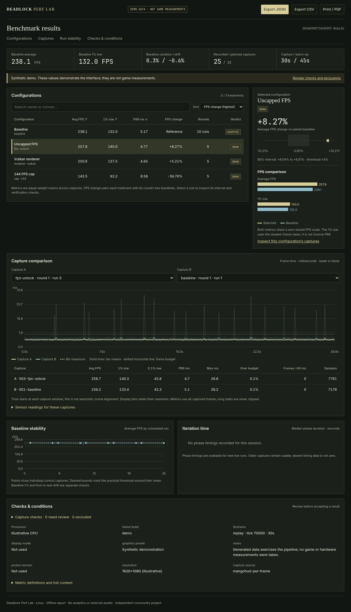

<div align="center">

# Deadlock Perf Lab

**Linux benchmark automation and configuration comparisons.**

A Linux performance experiment suite for Deadlock.<br>
Compare configurations, renderers and settings with repeatable captures, statistical comparisons and portable reports.

[](https://github.com/itchyfeetleech/deadlock-perf-lab/actions/workflows/ci.yml)
[](https://www.python.org/downloads/)
[](docs/QUICKSTART.md)
[](LICENSE)

[Get started](docs/QUICKSTART.md) · [How measurement works](docs/METHODOLOGY.md) · [Optimization guide](docs/OPTIMIZATION.md) · [Troubleshooting](docs/TROUBLESHOOTING.md)

</div>



## What it does

- **One installed application.** A terminal menu and a consistent `dpl` command, with no runtime Python dependencies.
- **Repeatable experiments.** Frozen profile contents, replay hashes, conditions and seeded run order. Every treatment round has opening and closing baselines.
- **Linux replay automation.** Launch → warm → seek back → capture → stop → restore. Native Steam, Proton, MangoHud and a local replay are required.
- **Community config testing.** Inspect and compare attributed OptimizationLock snapshots, custom cvar files, FPS caps and renderer flags. Whole GameInfo swaps require explicit experimental mode.
- **Manual experiments.** Test resolution, graphics, upscaling, Proton, driver and OS settings with the same import, validation and comparison pipeline.
- **Frame-time evidence.** Average FPS, true 1%/0.1% lows where supported, P95/P99, long stalls, frame-budget misses and available MangoHud telemetry.
- **Conservative comparisons.** Round-level confidence intervals, drift checks, duplicate detection and quality gates. Failed capture means a failed run, never placeholder FPS.
- **Recovery and sharing.** Journaled backups with checksum-verified restoration; self-contained interactive HTML, Markdown, JSON, CSV and report ZIP exports.

This is the **0.2 community preview**. Analysis, recovery and orchestration have automated tests; the exact game/Steam integration depends on the installed build. Automated replay captures require an operator to verify camera and playback progression before directional verdicts are enabled. This project does not promise a universal “best config.”

## Try it in a minute

Requires Linux and Python 3.11+. With [pipx](https://pipx.pypa.io/stable/installation/) installed:

```bash
pipx install 'git+https://github.com/itchyfeetleech/deadlock-perf-lab.git@v0.2.0'
dpl demo --open
```

The demo needs **no game, Steam or MangoHud**. All its values are explicitly synthetic, including exported reports. Run `dpl` for the guided menu or `dpl --help` for every command.

Alternatively, from a source checkout:

```bash
python3 -m venv .venv
source .venv/bin/activate
python -m pip install .
dpl demo --open
```

## Run a real experiment

```bash
dpl init --replay replays/my-match.dem
# Edit .lab/lab.json: replay, tick, player, timing, resolution, graphics and Proton.
dpl doctor
dpl setup
# Paste the displayed per-game launch options into Deadlock's Steam properties.
dpl profiles
dpl plan --cases fps-unlock --rounds 5
dpl run --live
dpl report --open
```

Read the [quickstart](docs/QUICKSTART.md) before the first live run. Close Deadlock first; the suite refuses to kill an existing game. All automated launches use `-insecure` and local replay/bot scenarios. Temporary files are restored on normal completion and handled failures. After power loss or a hard kill, close Deadlock and run `dpl recover`.

“Baseline” is **your existing setup**, including your current autoexec and GameInfo. It is not automatically a clean Valve installation. The tool does not persistently apply a winning configuration; inspect the result and choose your own permanent changes.

## Screen a large config matrix

```bash
dpl profile sweep examples/convar-matrix.csv --base '/path/to/Deadlock/game/citadel/gameinfo.gi'
dpl plan --cases 'gi*' --preset screen --experimental
dpl run --live
dpl timings
dpl shortlist --top 5
# Run a new --preset confirm experiment for selected candidates.
```

Screening uses one short round; confirmation uses five longer rounds. Replay readiness is detected from the engine instead of adding a fixed 20-second wait to every launch. Startup-only GameInfo changes still use a fresh game process. Use `--preset scout` for a shorter 5-second capture / 2-second warm-up pass. New runs record phase timings so Steam launch delays can be distinguished from sampling. See [faster benchmarking](docs/FAST_BENCHMARKING.md) and [release validation](docs/VALIDATION.md).

## Compare settings you change yourself

```bash
dpl profile add shadows-low --manual --description 'Change only shadow quality to Low'
dpl plan --manual --cases shadows-low --rounds 5
dpl setup --manual
# Apply each scheduled setting yourself and capture a separate log with MangoHud.
dpl import baseline.csv --case baseline --round 1 --interval-ms 0
# Continue in the order printed by the plan; each round ends with baseline again.
dpl report --open
```

See the [manual experiment walkthrough](docs/MANUAL_EXPERIMENTS.md). Imported files must match the session's system metadata, duration and logging resolution. The plan keeps manual and automatic experiments separate.

## Inspect the results

Search and sort the configuration table by FPS change, average FPS, 1% low or P99 frame time. Select a row to inspect its confidence interval and compare its capture with a baseline from the same round. Frame-time peaks, sensor readings, baseline history and verification checks remain available below. See [report design and references](docs/REPORT_DESIGN.md).

## Share the evidence

```bash
dpl compare
dpl export --output my-experiment.zip
```

A report ZIP contains four files: `index.html`, `summary.md`, `summary.json`, `runs.csv`. Open `index.html` in a browser; charts work offline. Logs, backups, profile file contents, replays and absolute replay paths are excluded. Labels and notes you wrote remain in the report; review them before sharing. The CLI never uploads results.

## What the numbers mean

Average FPS is `1000 / mean frame time`. The 1% low is `1000 / mean of the slowest ceil(1% × N) frame times`; it is **not** inverse P99. Long stalls remain in the data. MangoHud interval logs (such as 100 ms logging) are sampled estimates and cannot produce true per-frame lows.

“Improved” requires at least five complete paired rounds, stable baselines, cleared quality checks and a 95% interval entirely above the practical threshold (3% by default). These are exploratory comparisons, not proof that a setting helps every machine. FPS captures do not measure input latency, network quality, visibility or live-match competitiveness. Read the [methodology](docs/METHODOLOGY.md).

## Contribute

Bug reports, reproducible captures and new measurement backends are welcome. See [CONTRIBUTING.md](CONTRIBUTING.md), the [architecture](docs/ARCHITECTURE.md) and the [release checklist](docs/RELEASING.md).

The application and bundled community configs are distributed under GPL-3.0-only. Attribution and source hashes are in [THIRD_PARTY_NOTICES.md](THIRD_PARTY_NOTICES.md). This is an independent community project and is not affiliated with or endorsed by Valve, MangoHud or the included config authors.
